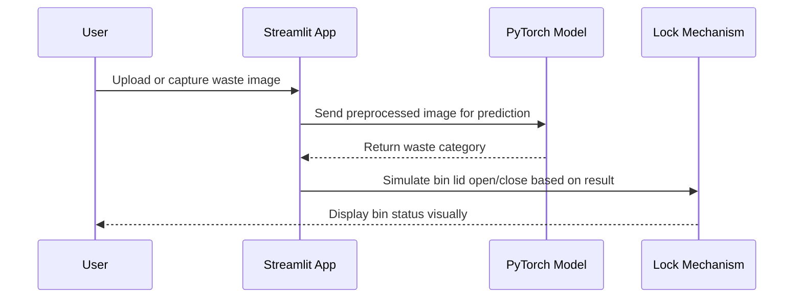

# 🗑️ Dustbin Lock Simulator

An **AI-powered Smart Dustbin Lock System** built with **PyTorch** and **Streamlit**, designed to automatically identify waste types from an image and simulate the opening of the correct bin lid.

---

## 🚀 Project Overview

The **Dustbin Lock Simulator** mimics how a smart waste management system would work using computer vision.  
The app classifies uploaded or captured waste images (like bottles, vegetables, paper, etc.) and automatically determines which type of dustbin lid should open — **organic, plastic, metal, or paper**.

This concept can be extended for **IoT-based smart bins** with servo motors and sensors.

---

## 🧩 Features

✅ **AI Classification:** Uses a pretrained PyTorch model (MobileNetV2) to recognize waste type  
✅ **Streamlit UI:** Simple, interactive web app interface  
✅ **Smart Lock Simulation:** Visually represents bin lid opening  
✅ **Webcam Support:** Capture live waste image directly  
✅ **Lightweight:** Fast inference, runs locally or on cloud

---

## 🏗️ System Architecture

```mermaid
flowchart TD
    A[User Uploads or Captures Image] --> B[Image Preprocessing with TorchVision]
    B --> C[Pretrained PyTorch Model (MobileNetV2)]
    C --> D[Prediction Layer]
    D --> E{Waste Type Identified?}
    E -->|Organic| F[Green Bin ♻️ Opens]
    E -->|Plastic| G[Blue Bin 🧴 Opens]
    E -->|Metal| H[Grey Bin ⚙️ Opens]
    E -->|Paper| I[Yellow Bin 📄 Opens]
    E -->|Unknown| J[Reject 🚫 - Lid Locked]
```

---

## 🔁 Sequence Flow



---

## 🗂️ Waste Category Mapping

| Waste Type | Bin Color | Example Items | Lid Action |
|-------------|------------|----------------|-------------|
| 🟢 **Organic** | Green | Food scraps, vegetables | Open |
| 🔵 **Plastic** | Blue | Bottles, wrappers | Open |
| ⚙️ **Metal** | Grey | Cans, foil | Open |
| 🟡 **Paper** | Yellow | Newspapers, tissues | Open |
| 🔴 **Unknown** | Red | Non-classifiable | Locked |

---

## ⚙️ Installation Guide

### 1️⃣ Clone the Repository

```bash
git clone https://github.com/<your-username>/dustbin-lock-simulator.git
cd dustbin-lock-simulator
```

### 2️⃣ Create Virtual Environment (Recommended)

```bash
python -m venv venv
venv\Scripts\activate     # On Windows
source venv/bin/activate  # On Linux/Mac
```

### 3️⃣ Install Dependencies

```bash
pip install -r requirements.txt
```

### 4️⃣ Run the Application

```bash
streamlit run dustbin_simulator/app.py
```

OR double-click:
```
run_app.bat
```

---

## 🧠 How It Works

1. User uploads or captures an image.  
2. Image is resized and normalized using TorchVision transforms.  
3. Pretrained PyTorch model predicts the most probable class.  
4. The simulator maps prediction → bin type (organic/plastic/metal/paper).  
5. A visual simulation shows which bin lid opens.

---

## 📦 Project Structure

```
dustbin-lock-simulator/
│
├── dustbin_simulator/
│   ├── __init__.py
│   └── app.py
│
├── requirements.txt
├── setup.py
├── run_app.bat
└── README.md
```

---

## 💡 Future Enhancements

- 🧲 **Hardware Integration:** Connect to Raspberry Pi with servo motors for actual lid control  
- ☁️ **IoT Cloud Sync:** Real-time monitoring via MQTT or Azure IoT Hub  
- 📊 **Analytics Dashboard:** Track waste type frequency in real-time  
- 🤖 **Custom Model Training:** Train domain-specific waste classifier using PyTorch Lightning  

---

## 🧰 Tech Stack

| Component | Technology Used |
|------------|----------------|
| UI | Streamlit |
| ML Framework | PyTorch |
| Model | MobileNetV2 (pretrained) |
| Image Processing | TorchVision, Pillow |
| Packaging | setuptools |

---

## 📸 Sample Output

**Upload Waste Image → Model Classifies → Bin Opens**

```
🧠 Detected Waste Type: Plastic
🗝️ Bin Opening Simulation: Blue bin lid opened!
```

---

## 🧑‍💻 Author

**Vijay Shinde**  
AI & Cloud Architecture | IoT Innovator  
📧 Email: vijay.shinde@example.com  
🌐 [LinkedIn](https://linkedin.com/in/vijayshinde)

---

## 🪪 License

This project is licensed under the MIT License — see the [LICENSE](LICENSE) file for details.
